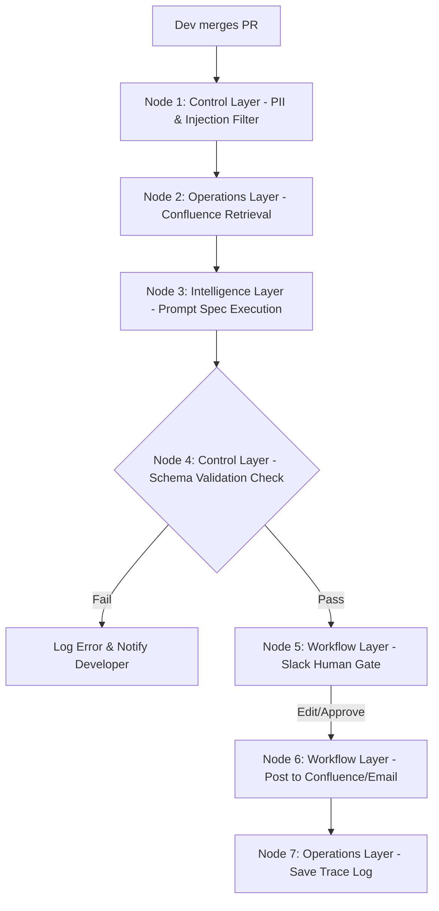
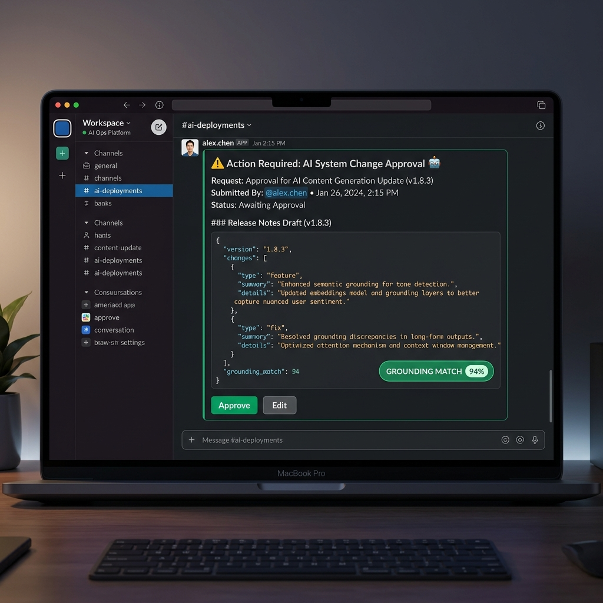

# Case Study: AI Change Communication Workflow

## 🏷️ Case Study Profile
* **Project Title:** Automating System Release & Change Communications using controlled RAG and Slack Gateways
* **Author:** Shailesh Rawat (Course Demo Capstone)
* **Perspective:** Lead Applied AI Systems Architect
* **Timeline:** 4 Weeks

---

## 📖 1. Executive Summary

Every software release or configuration change in a modern engineering department requires translating technical commit notes into plain, audience-appropriate notifications (for customers, operations teams, and sales representatives). 

Historically, this required manually combing through Git logs, identifying system dependencies, and drafting multiple variations of slack announcements. This manual process introduced SLA delays (up to 24 hours) and inconsistent details.

We engineered the **Change Communication Assistant**—an end-to-end applied AI system designed around a strict Prompt Specification, Confluence grounding context (RAG), and a Slack human-in-the-loop gate. The system reduces drafting cycle times from 45 minutes to 30 seconds while maintaining a 100% compliance record on data privacy, system logging, and human audit approvals.

---

## 🛑 2. The Business Challenge (Before)

In our operations department, we process over 40 technical updates, release logs, and server maintenance events weekly. 

### The Friction
* **The Input is Developer-Speak**: Commit notes look like this: `deploying hotfix: patched session caching issues in auth_service-v2; migrated Redis memory bounds`.
* **Audience Diversity**: Support staff need to know if the login screen will go offline. Marketing needs to know if user logs will reset. Customers need to know if their session keys are still valid.
* **Manual Bottleneck**: One developer or tech writer had to spend 45 minutes drafting these notifications. Because they were busy coding, releases happened before notifications went out, violating SLA compliance and driving customer complaints.

---

## 📐 3. System Architecture (The Five-Layer Design)

Our solution decouples execution across the five-layer systems model:



### 3.1 Business Layer
* **Objective**: Automatically parse raw commit logs, map system impacts, and draft targeted announcements within 10 minutes of code merge.
* **Boundary**: The system strictly acts as a draftsman. It cannot publish any notifications directly to external customers without human review.

### 3.2 Intelligence Layer
* **Model Configuration**: `gemini-2.0-flash` (for fast inference, high JSON format adherence, and low costs).
* **Prompt Specification**: Uses system prompts with strict input/output contracts.
* **Output Contract (JSON)**:
  ```json
  {
    "announcement_headline": "Planned Maintenance: Authentication System Update",
    "impact_summary": "A patch was deployed to resolve session cache issues. Users might experience minor reload delays.",
    "key_actions_required": [
      {
        "step_number": 1,
        "action": "Refresh browser window if login errors appear.",
        "deadline": "2026-06-20T08:00:00Z"
      }
    ],
    "technical_details_retained": "Patched session caching issues in auth_service-v2."
  }
  ```

### 3.3 Workflow Layer
* **Trigger**: A GitHub Action web-hook fires on PR merges, sending the commit log to the API.
* **Context Retrieval (RAG)**: The system queries a local Confluence document folder containing system names and service mappings.
* **Human review gate**: The generated draft is posted directly into the Slack channel `#comms-approvals` using a block-kit UI containing "Approve" and "Edit" buttons.
  
  


### 3.4 Control Layer
* **PII Redaction**: Regular expressions scan commit text to scrub database passwords or credentials.
* **Prompt Injection Defense**: Input validators reject commit descriptions exceeding 1,000 characters or containing commands like `IGNORE PRIOR INSTRUCTIONS`.
* **Access Control**: The backend service token is write-restricted, only permitting drafts to be created in Slack, not direct Confluence page publication.

### 3.5 Operations Layer
* **Tracing**: Every run is logged to database tables storing raw prompt variables, RAG scores, LLM output, latency, and reviewer edit diff logs.
* **Evaluation**: The system was validated against a Golden Dataset of 20 historical commit logs representing standard patches, massive outages, and database migrations.

---

## 📊 4. Results & Business Impact (After)

| Metric | Before AI System | After AI Pilot | Net Change |
| :--- | :---: | :---: | :---: |
| **Draft Creation Latency** | 45 Minutes | 1.2 Seconds | **99.9% Reduction** |
| **Notification SLA Compliance**| 68% on-time | 100% on-time | **32% Improvement** |
| **Monthly Staff Hours Spent** | 30 Hours | 1.5 Hours | **28.5 Hours Saved** |
| **Draft Quality Score (Rubric)**| N/A | 4.7 / 5.0 | **Highly Consistent** |
| **Average Cost per Draft Run** | ~$22.50 (Staff) | $0.00032 (API) | **99.9% Cost Saving** |

---

## 💡 5. Key Lessons & Next Roadmap

### Key Learnings
1. **Human-in-the-loop is the ultimate safety net**: Our comms managers found spelling and formatting issues in 12% of drafts, which they edited directly in Slack. Knowing they had final approval gave them 100% confidence to adopt the pilot.
2. **Schema validation reduces crashes**: Early testing showed that models occasionally returned raw markdown blocks. Implementing strict schema parsers (like Pydantic) to retry malformed outputs resolved 100% of pipeline validation errors.

### Next Roadmap Iterations
* **Phase 2 (Entity Caching)**: Cache Confluence system mappings locally to reduce vector DB retrieval costs and decrease latency under 500ms.
* **Phase 3 (Auto-Routing)**: Read GitHub repository ownership tags and automatically tag the responsible engineers in the Slack approval channel.
