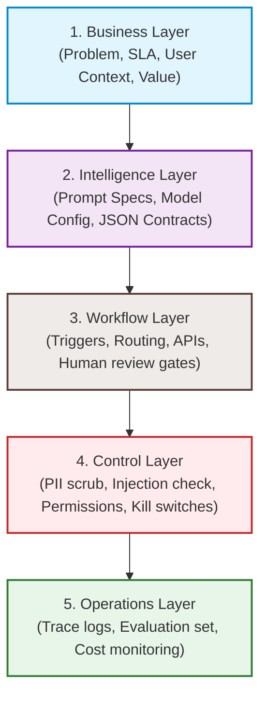

# 1.3 The Five-Layer Applied AI Systems Model

## Why This Matters
When building traditional software, engineers use established architectures (like Model-View-Controller or microservices) to organize code, manage state, and isolate risks. In AI development, builders often dump everything into a single, massive script, mixing system prompts, API keys, database queries, and web UI code. This makes the system impossible to test, debug, or secure. The **Five-Layer Applied AI Systems Model** provides a structured architecture to design inspectable and secure AI workflows.

---

## Core Idea

The Five-Layer Model isolates system responsibilities into five distinct, decoupled layers:

1. **Business Layer**: The foundation. Defines the problem, the target user, the desired business outcome, and the cycle-time constraints (SLAs).
2. **Intelligence Layer**: The cognitive processor. Defines what the model is responsible for, its system prompts, instructions, few-shot examples, reasoning boundaries, and structured JSON contracts.
3. **Workflow Layer**: The pipes. Coordinates how information moves. Defines the trigger event, routing rules, tool APIs (Model Context Protocol), loop logic, and human approval checkpoints.
4. **Control Layer**: The shield. Handles security and compliance. Defines input scrubbers (PII redaction), security validation (prompt injection detection), permission limits (read-only vs. write), audit trails, and emergency kill switches.
5. **Operations Layer**: The mechanic. Manages quality and observability. Tracks token metrics, execution costs, latency traces, automated evaluation datasets, and rollback deployment plans.

---

## System View
The Five-Layer Model is the overarching framework for this entire course. Every template, lab, and capstone document you create will map directly to one or more of these layers.

---

## Example: AI Email Responder
Let's see how an AI customer email assistant is designed using the model:
* **Business Layer**: Goal is to reduce support response SLA from 12 hours to 2 hours for active subscribers.
* **Intelligence Layer**: A prompt spec takes `email_text` and `customer_profile`, outputting a JSON draft response and priority categorization.
* **Workflow Layer**: Email arrives (Trigger) -> Retrieve customer metadata -> Call model -> Route draft to support queue for human review.
* **Control Layer**: Scrub credit card details from email text before sending to OpenAI; restrict tool write access to support portal drafts folder.
* **Operations Layer**: Run 50 mock customer emails through the prompt spec weekly to verify that response accuracy stays above 4.5/5.

---

## Practical Walkthrough
When designing a new system, map the layers in order, starting from the Business Layer:
1. Identify the friction point and target user (**Business**).
2. Write down what documents or guidelines the system needs (**Intelligence / RAG**).
3. Diagram the workflow steps and highlight where the human sign-off button sits (**Workflow**).
4. List the compliance risks, PII hazards, and API rate limit concerns (**Control**).
5. Establish a baseline dataset of 10-20 test cases to measure quality and costs (**Operations**).

---

## Common Failure Modes
* **Bottom-Up Design**: Starting with the Operations Layer ("Let's deploy a vector database!") or the Intelligence Layer ("Let's play with Gemini!") before defining the Business Layer friction point and user boundary.

---

## Lab
Open your project's **AI Opportunity Brief** and verify that you can identify which section maps to each of the five layers.

---

## Output
This model serves as the blueprint for your **Final Pilot Pack Summary** (Template 20).

---

## Review Checklist
* `[ ]` Can you identify where the Control Layer intersects with your model's API call?
* `[ ]` Are your business value goals explicitly defined without reference to AI tools?

---

## Reflection
*If a security auditor asked you to prove that customer emails do not leak system prompt instructions, which layer of your system holds that proof?*
