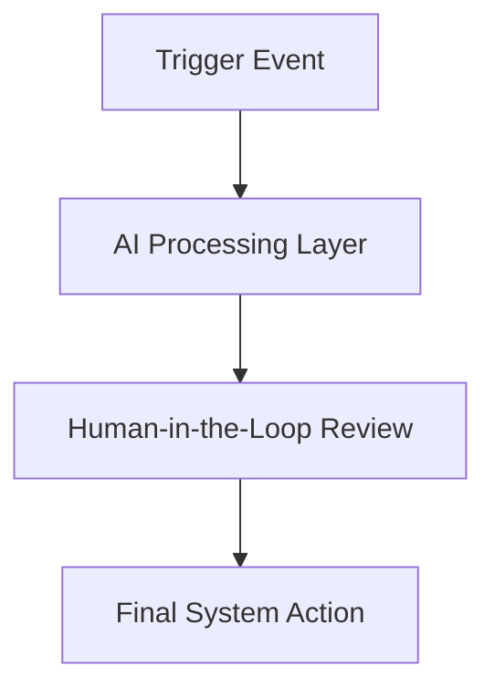

# Template 03: AI Opportunity Brief

The AI Opportunity Brief is a formal project charter designed to align stakeholders and builders before writing any prompts or code. It defines the business case, workflow boundaries, AI capabilities, and risk mitigations.

---

## 📋 General Metadata

* **Project Name:** 
* **Business Owner:** 
* **Technical Lead / Builder:** 
* **Last Updated:** 
* **Current Version:** `0.1-draft`

---

## 🎯 1. Business & User Layer

### 1.1 Problem Statement
*Describe the business problem, operational friction, or bottleneck. Quantify the pain (e.g., hours lost, error rate, delayed SLA).*

### 1.2 Target User Persona
*Who is the user interacting with this system? What is their technical level and workflow context?*

### 1.3 Expected Business Value
*What are the tangible business returns? (e.g., reduce time-to-respond from 4 hours to 10 minutes, save 15 developer hours/week).*

---

## 🧠 2. Intelligence & Boundary Layer

### 2.1 AI Role & Task Scope
*What exactly will the AI model be responsible for? Describe the input and the expected structured output.*

### 2.2 Boundary Statement (What the AI does NOT do)
*Define explicit limits. What actions, decisions, or system connections are strictly out-of-scope for the model? (e.g., "The model drafts the response but NEVER hits send directly").*

### 2.3 Required Context & Knowledge
*What background data, documentation, style guides, or API logs does the model require to perform this task accurately?*

---

## 🔄 3. Workflow & Orchestration Layer

### 3.1 Workflow Step Mapping

*Describe the trigger, the intermediate AI step, the human review point, and the final action:*
* **Trigger Event:** 
* **AI Processing Step:** 
* **Human-in-the-Loop Gate:** 
* **Final System Action:** 

---

## 🛡️ 4. Control, Governance & Risk Layer

### 4.1 Risk Assessment & Mitigation

| Identified Risk | Risk Impact (L/M/H) | Mitigation Control |
| :--- | :---: | :--- |
| **Hallucination / Inaccurate Output** | | e.g., Ground the model in context documents with strict citations |
| **Data Leakage (PII / IP)** | | e.g., Filter inputs and redact customer details before calling API |
| **Excessive Agency (Tool Misuse)** | | e.g., Restrict write permissions; require human button-clicks for mutations |

### 4.2 Security & Compliance Requirements
*Are there any regulatory (GDPR, HIPAA) or internal data policy constraints that apply to this workflow?*

---

## 📊 5. Operations & Success Metrics

### 5.1 Success KPI
*What is the primary indicator of a successful pilot? (e.g., >80% user adoption, user satisfaction score of 4+/5, prompt cost <$0.02 per run).*

### 5.2 Failure Definition
*What does failure look like? (e.g., model errors out >2% of the time, users find the generated drafts unusable and rewrite them from scratch).*
