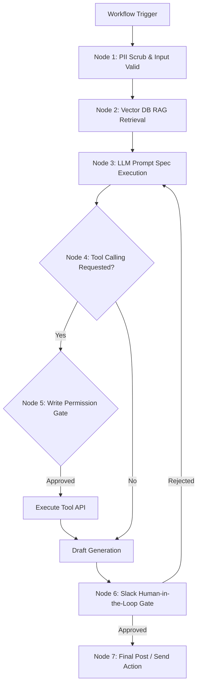

# Template 20: Final Pilot Pack

The AI Workflow Pilot Pack compiles all your module outputs into a single, comprehensive system documentation bundle. It is the final deliverable for the Capstone Project, demonstrating your readiness to pilot the system in a production environment.

---

## 📄 Pilot Pack Profile

* **Project Name:** 
* **Target Environment:** 
* **Compiled By:** 
* **Version:** `1.0.0-final`
* **Date Compiled:** 

---

## 📂 Table of Contents

This pilot package contains the following linked artifacts (verify all files are completed):

1. **[Section 1: AI Opportunity Brief](templates/ai-opportunity-brief.md)**
   * Defines the business friction, user persona, and value metrics.
2. **[Section 2: Prompt Specification Pack](templates/prompt-specification.md)**
   * The versioned prompt schema, reasoning boundaries, and JSON contracts.
3. **[Section 3: Output Quality Rubric](templates/output-quality-rubric.md)**
   * The formal criteria and grading system for audit.
4. **[Section 4: RAG Readiness & Retrieval Design](templates/retrieval-design-template.md)**
   * The chunking strategy, metadata filters, and grounding prompts.
5. **[Section 5: Tool Permission Map](templates/tool-permission-map.md)**
   * API schemas, read/write boundaries, and error recovery policies.
6. **[Section 6: Agent Workflow Canvas](templates/agent-workflow-canvas.md)**
   * Orchestration patterns, state tracking, and stop conditions.
7. **[Section 7: Memory & Context Policy](templates/memory-context-policy.md)**
   * Chat buffer limits, summaries, and PII anonymization rules.
8. **[Section 8: Evaluation Harness Plan](templates/evaluation-harness-template.md)**
   * The 20+ test cases, inputs, and pass/fail assertion rules.
9. **[Section 9: Governance & Risk Pack](templates/governance-pack.md)**
   * Risk registers, human gates, audit trails, and emergency kill switches.
10. **[Section 10: ROI & Adoption Plan](templates/roi-snapshot.md)**
    * Development costs, monthly run estimations, and user training scripts.
11. **[Section 11: Demo Script](templates/demo-script.md)**
    * The 5-minute presenter workflow and edge-case validation logs.

---

## 📐 Systems Architecture Diagram

---

## 🚀 Pilot Launch Roadmap

Describe the immediate steps for deploying the pilot:

* **Week 1 (Setup & Playground Testing):** Setup sandbox environment, build vector indices, run evaluation cases.
* **Week 2 (Integration & Slack Gate):** Integrate down-stream tools, configure Slack webhook approval nodes.
* **Week 3 (Staff Enablement & Beta):** Enable 3 target reviewers to use the tool in staging, gather feedback.
* **Week 4 (Review & Report):** Audit logs, calculate actual ROI metrics, compile Case Study, present to stakeholders.
